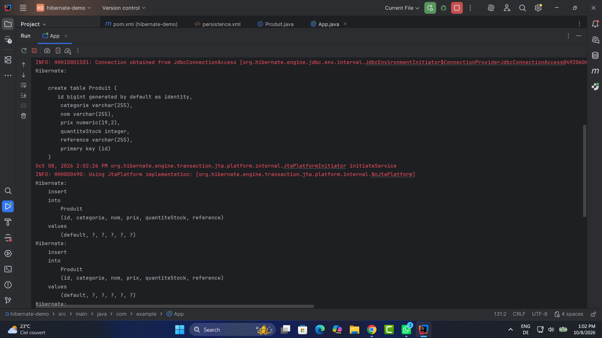
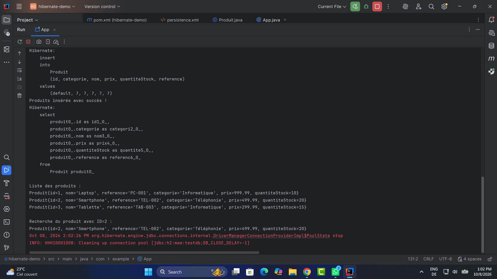

## Captures d'écran

### 1. Création de la table `Produit`

Cette capture montre l'exécution d'Hibernate au démarrage de l'application.  
À partir de l'entité `Produit`, Hibernate génère automatiquement la table correspondante dans la base de données H2.

On peut voir dans la console la requête SQL de création de la table avec les différents champs : `id`, `nom`, `reference`, `categorie`, `prix` et `quantiteStock`.



---

### 2. Exécution de l'application

Cette capture montre le résultat de l'exécution du programme dans IntelliJ IDEA.

Trois produits sont insérés dans la base de données à l'aide de la méthode `persist()` :

- Laptop
- Smartphone
- Tablette

Une requête JPQL permet ensuite de récupérer et d'afficher la liste des produits enregistrés.

Le programme effectue également une recherche du produit ayant l'identifiant `2` avec la méthode `find()`.



---

### 3. Vérification des données avec la console H2

Cette capture montre la console Web de la base de données H2.

La requête suivante permet de vérifier directement les données enregistrées :

```sql
SELECT * FROM PRODUIT;
